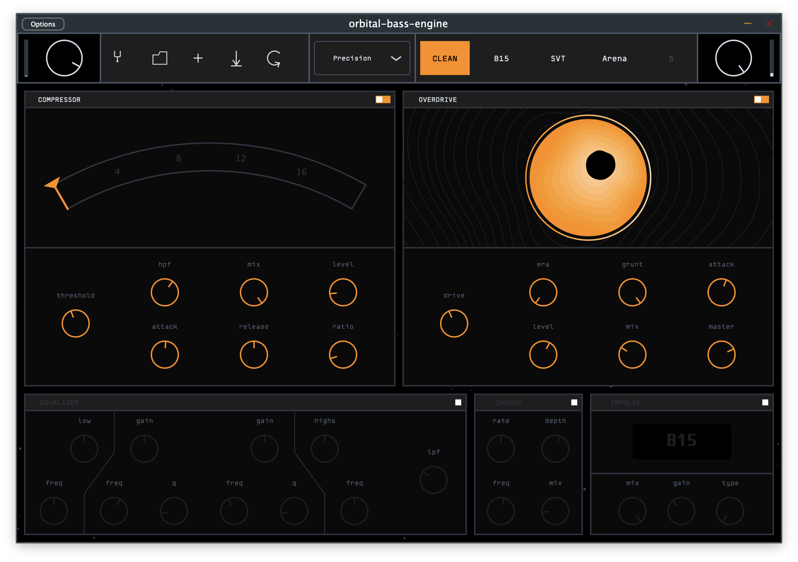

# Orbital Bass Engine

"Bass tone open-source optimization protocol: launch sequence initiated."



## Overview

Orbital Bass Engine is an open-source bass guitar audio plugin built with the JUCE framework. It provides a complete signal processing chain designed specifically for bass guitar, featuring analog-modeled compression, dual-drive amplification, and a post-amp effects rack.

The plugin processes bass signals through a carefully crafted signal chain that preserves low-end clarity while adding character, punch, and presence. All components are designed with bass frequencies in mind, ensuring tight, powerful tones without muddiness.

## Signal Chain

The audio processing flows through the following stages:

1. **Input Gain** - Initial level control
2. **Tuner** - Chromatic tuner with YIN pitch detection
3. **Compressor** - Dynamics control with analog-modeled FET circuit
4. **Amp/Dual-Drive** - Overdrive and distortion (Helios or Borealis models)
5. **EQ** - 6-band tone shaping with low-pass filter
6. **Chorus** - Stereo width and modulation (post mono-to-stereo conversion)
7. **IR Convolver** - Cabinet simulation using impulse responses
8. **Output Gain** - Final level control

Each stage can be individually bypassed.

## Components

### Tuner

A chromatic tuner powered by a YIN pitch detection algorithm. Optimized for bass guitar frequencies down to low E (~41Hz) with an 8192-sample buffer for accurate low-frequency detection.

### Compressor

FET-style compression with fast attack and aggressive character, using JFET circuit modeling for punchy, colorful dynamics control.

**Controls:**
- Threshold (-48dB to 0dB)
- Ratio (2:1, 4:1, 8:1, 12:1, 20:1)
- Level (makeup gain, 0dB to 24dB)
- Mix (parallel compression, 0% to 100%)

### Overdrive

**Controls:**
- Drive (0-10)
- Era - tone/voice shaping (0-10)
- Grunt - amount of low-frequency content sent to overdrive (0-10)
- Attack - amount of high-frequency content sent to overdrive (0-10)
- Mix (0% to 100%)
- Master (-24dB to 12dB)

### EQ

A 4-band parametric equalizer, includuing two fully parametric mid peak filters, a low-shelf and a high-shelf.

Each band offers +/-12dB of gain.

### Chorus

Stereo chorus with multiband processing to preserve low-end focus.

**Controls:**
- Rate (0.5Hz to 2.5Hz)
- Depth
- Crossover (50Hz to 1kHz - frequencies below remain untouched to avoid phase-issues)
- Mix (0% to 100%)

### IR Convolver

Cabinet simulation using built-in impulse responses with parallel processing. It uses the IR from the Shift-Line free pack available there: `https://shift-line.com/irpackbass`

**Controls:**
- IR Type (selectable)
- Level (-36dB to 12dB)
- Mix (0% to 100%)

### Sessions & Presets

The plugin supports sessions containing up to 5 presets. Sessions are saved to disk and automatically restored on startup.

## Building

### Requirements

- CMake 3.24+
- C++17 compiler
- JUCE (included as a git submodule)

### macOS

```sh
git submodule update --init --recursive
make init-release
make build-release
```

### Windows (GitHub Actions)

A manually-triggered GitHub Actions workflow is available to build on Windows. Go to **Actions > Build Windows > Run workflow**.

### Windows (cross-compile via Docker)

```sh
make build-windows
```
