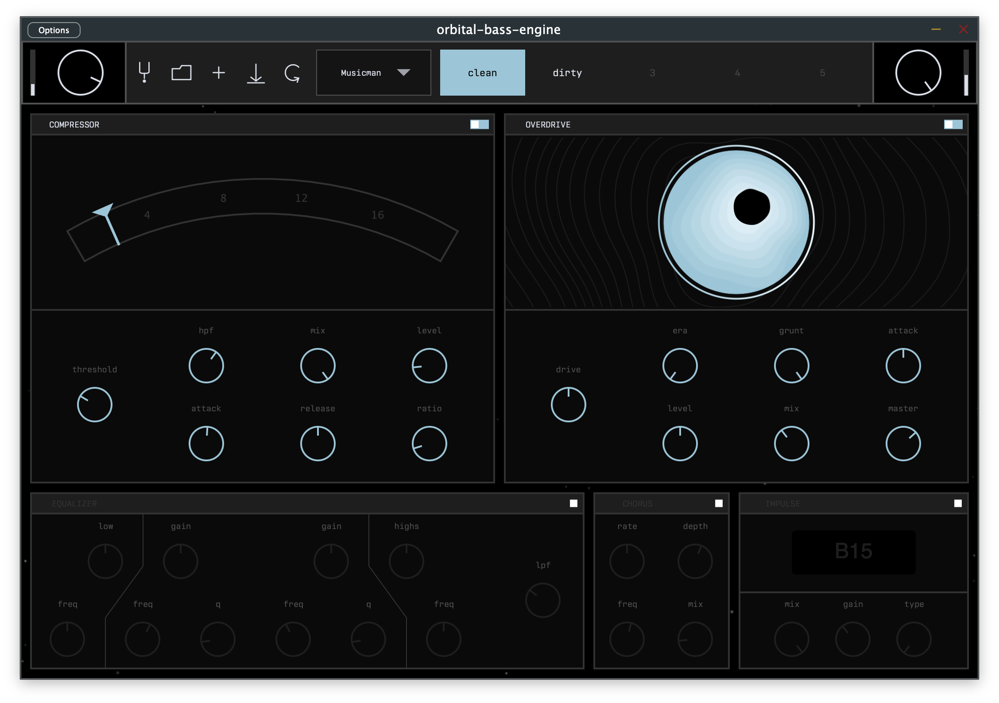

# Orbital Bass Engine

"Bass tone open-source optimization protocol: launch sequence initiated."



## Overview

Orbital Bass Engine is an open-source bass guitar audio plugin built with the JUCE framework. It provides a complete signal processing chain designed specifically for bass guitar, featuring analog-modeled compression, vintage-style drive amplification, and a post-amp effects rack.

The plugin processes bass signals through a carefully crafted signal chain that preserves low-end clarity while adding character, punch, and presence. All components are designed with bass frequencies in mind, ensuring tight, powerful tones without muddiness.

## Installation

### MacOS

1. Click on "Releases" on the right of the repository screen.
2. Download the corresponding zip file (Standalone, VST3, AU).
3. Unzip the file.
4. Now you should be able to see the file `orbital-bass-engine.app`, `orbital-bass-engine.component` or `orbital-bass-engine.vst3`
5. Right-click on the file and click on "Copy as filepath".
6. Open the terminal app and type the command from 7.
7. Either right-click and open to bypass the apple warning (or `xattr -cr <filepath_copied_from_above>`)
8. Open the app if it's standalone, or copy the vst/au file inside your DAW plugin folder.

### Windows

1. Click on "Releases" on the right of the repository screen.
2. Download the corresponding zip file (Standalone, VST3, AU)
3. Unzip the file
4. Now you should be able to see the file `orbital-bass-engine.exe`, `orbital-bass-engine.component` or `orbital-bass-engine.vst3`
5. Open the app if it's standalone, or copy the vst/au file inside your DAW plugin folder.

## Signal Chain

The audio processing flows through the following stages:

1. **Input Gain** - Initial level control
2. **Tuner** - Chromatic tuner with YIN pitch detection
3. **Compressor** - Dynamics control with analog-modeled FET circuit
4. **Overdrive** - Overdrive with a vintage vibe
5. **EQ** - 4-band parametric tone shaping with low-pass filter
6. **Chorus** - Stereo width and modulation (post mono-to-stereo conversion)
7. **IR Convolver** - Cabinet simulation using impulse responses
8. **Output Gain** - Final level control

Each stage can be individually bypassed.

## Components

### Tuner

A chromatic tuner powered by a YIN pitch detection algorithm. Optimized for bass guitar frequencies down to low E (~41Hz) with an 8192-sample buffer for accurate low-frequency detection.

### Compressor

FET-style compression with fast attack and aggressive character, using JFET circuit modeling for punchy, colorful dynamics control.

**Controls:**
- Threshold (-48dB to 0dB)
- Ratio (2:1, 4:1, 8:1, 12:1, 20:1)
- Level (makeup gain, 0dB to 24dB)
- Mix (parallel compression, 0% to 100%)

### Overdrive

The overdrive tries to emulate the famous Darkglass Vintage Microtubes pedal by modeling the circuit components of the original circuit using digital filters and a saturation curve directly taken from the following research paper: https://www.dafx.de/paper-archive/2020/proceedings/papers/DAFx2020_paper_21.pdf

**Controls:**
- Drive (0-10)
- Era - tone/voice shaping (0-10)
- Grunt - amount of low-frequency content sent to overdrive (0-10)
- Attack - amount of high-frequency content sent to overdrive (0-10)
- Mix (0% to 100%)
- Master (-24dB to 12dB)

### EQ

A 4-band parametric equalizer, including two fully parametric mid peak filters, a low-shelf and a high-shelf.

Each band offers +/-12dB of gain.

### Chorus

Stereo chorus with multiband processing to preserve low-end focus.

**Controls:**
- Rate (0.5Hz to 2.5Hz)
- Depth
- Crossover (50Hz to 1kHz - frequencies below remain untouched to avoid phase-issues)
- Mix (0% to 100%)

### IR Convolver

Cabinet simulation using built-in impulse responses with parallel processing. It uses the IR from the [Shift-Line free pack](https://shift-line.com/irpackbass).

**Controls:**
- IR Type (B15, SVT810, EBS410, XL410, PPC212, TC410)
- Level (-36dB to 12dB)
- Mix (0% to 100%)

### Preset Collections

Presets are organized into **collections** within a user-chosen root folder. Each collection is a subdirectory containing up to 5 presets.

- Click the **folder icon** to select a root folder
- Click the **+ button** to create a new collection
- Use the **dropdown** to switch between collections
- Click a **preset slot** to load a preset, use the **save icon** to save the current state, and the **reload icon** to revert to the saved state

The root folder, last selected collection, and last selected preset are all persisted and automatically restored on startup.

## Download

Pre-built binaries for macOS and Windows are available on the [Releases](../../releases) page.

### macOS

The app is not code-signed, so macOS Gatekeeper will quarantine it after download. To open it:

- **Right-click** (or Control-click) the app and choose **Open** from the context menu, then click **Open** in the dialog.

Alternatively, remove the quarantine attribute via Terminal:

```sh
xattr -cr /path/to/orbital-bass-engine.app
```

## Building

### Requirements

- CMake 3.24+
- C++17 compiler
- JUCE (included as a git submodule)

### macOS

```sh
git submodule update --init --recursive
make init-release
make build-release
```

### Windows (cross-compile via Docker)

```sh
make build-windows
```

## Releasing

Pushing a version tag triggers a GitHub Actions workflow that builds both macOS and Windows, then creates a GitHub Release with the artifacts attached:

```sh
git tag v1.0.0
git push <remote> v1.0.0
```
